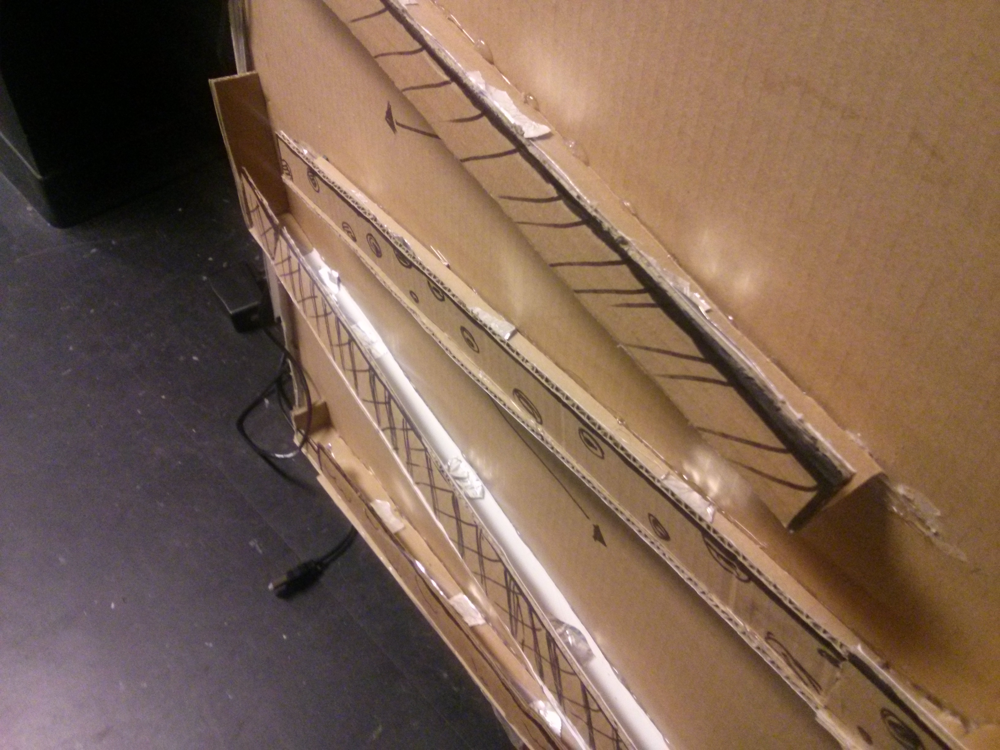
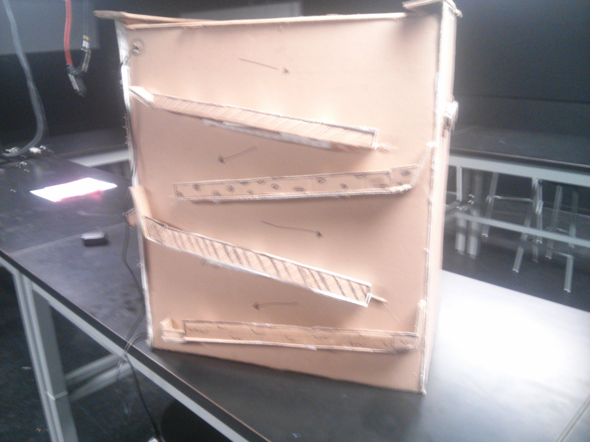
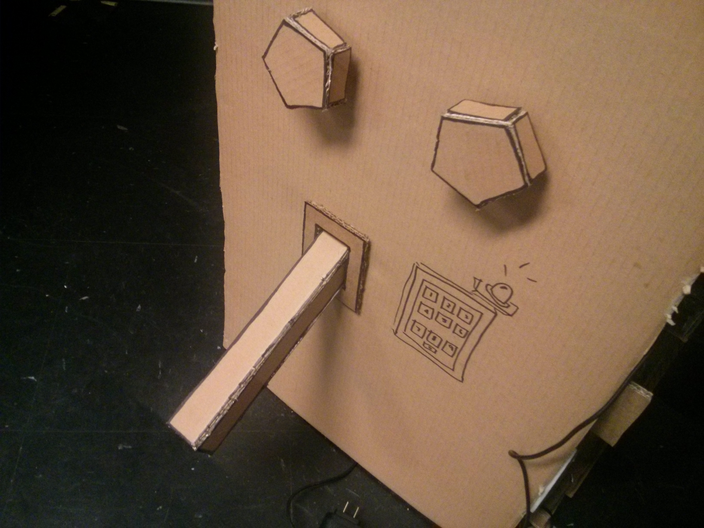
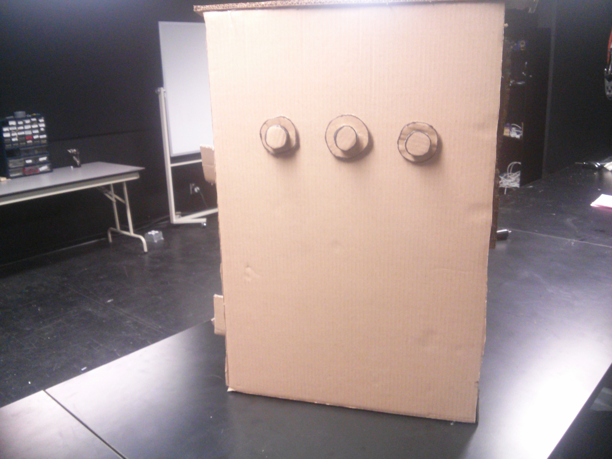
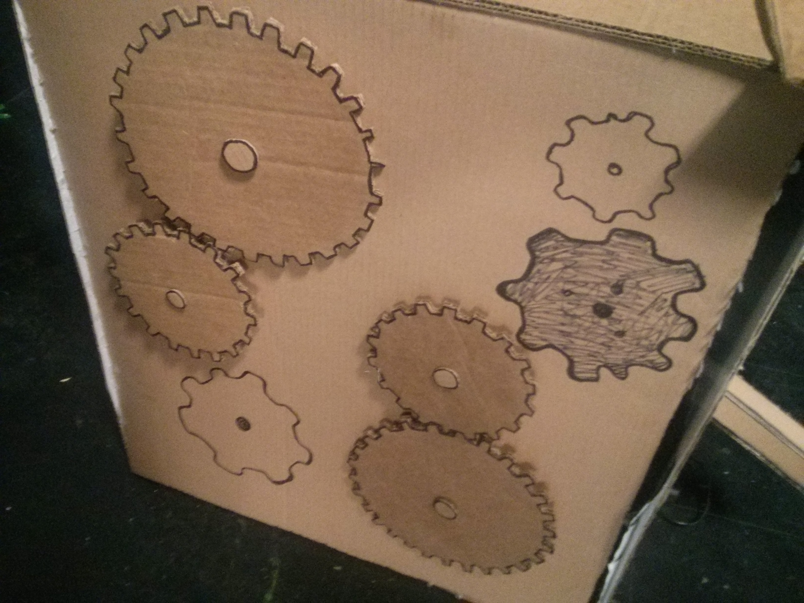

#modern-times
============

## Idée de départ : 
Notre intention initiale était de créer une boîte récréant l'univers d'une usine. Notre source d'inspiration fut les premières scènes du film "Modern Times" de Charlie Chaplin, plus particulièrement la première scène, où le protagoniste travaille en usine. Ainsi, un côté serait recouvert de rouages, un autre de boutons et de leviers et un dernier côté comporterait une glissade de boules qui s'illuminent lorsque la boule est au-dessus.

## Inspirations 

Ce projet réalisé par Saskia Freeke, Fin Kingma, Davy Jacobs et Sonja Van Vuure, quatre étudiants du "Utrecht School of Art and Technology", nous a grandement inspiré quant à la réalisation des procédés mécaniques et du style général de notre projet. 

## Matériel :
- Arduino Leonardo avec une alimentation 5V
- 1 alimentation 5V (pour les moteurs et la led strip)
- 1 [Capactive Sensor d'Adafruit](http://www.adafruit.com/products/1982) 
- 2 moteurs DC
- 3 potentiomètres
- 3 boutons
- [1 mètre de DELs](http://www.spikenzielabs.com/Catalog/index.php?main_page=product_info&cPath=26_154&products_id=1025&zenid=6d3850ce256ef4623f7453278f76d89b)
- Des feuilles d'alluminium
- Beaucoup de carton

##Conception : 
- Le coté des rouages est contrôlé par deux moteurs indépendant qui permettent d'avoir deux couches de rouages tournant dans des sens et à des vitesses indépendantes. Le sens et la vitesse des moteurs sont contrôlés par deux potentiomètres placés sur le coté comportant tous les boutons et leviers.

- Le coté de la boule comporte trois étages de glissades, avec des bandes de DELs collées sous celles-ci. En recouvrant la boule d'aluminium et en collant de petites bandes d'alluminium sur les glissages, on détecte la conductivité grâce au "Capacitive touch sensor breaker" d'Adafruit. 

- Le côté comportant tous les boutons, potentiomètres et leviers comporterait trois boutons permettant de changer les modes d'animations des bandes de DELs. Deux leviers fonctionnant grâce des potentiomètres placés à l'horizontale contrôleraient le sens dans lequel tournent les moteurs. Enfin, les deux derniers potentiomètres placés à la verticales contrôlent la vitesse de rotation des moteurs des rouages. 

##Difficultés rencontrées : 
Lors de la réalisation de notre projet, nous avons rencontré divers problèmes inattendus qui nous ont fait perdre énormément de temps. Le projet n'a pas pû être livré. 

- La réalisation de rouages à la main était particulièrement ardue. Le découpage du carton prit énormément de temps.

- Lors de l'installation des bandes de DELs sur la boîte, nous étions inconscient que nous devions les installer dans un sens en particulier, perdant ainsi beaucoup de temps à tenter de comprendre le problème. Aussi, la soudure fût relativement difficile et plusieurs fils ont dû être re-soudés.

- Le capteur de capacitance n'a pas fonctionné selon [les indications sur le site d'Adafruit](https://learn.adafruit.com/adafruit-mpr121-12-key-capacitive-touch-sensor-breakout-tutorial?view=all). Les mesures n'étaient que "bruit". Là où le document d'aide indiquait de connecter seulement l'un des "ground" du senseur au "ground" de notre Arduino, en essayant de tous les connecter, nous sommes parvenus à recevoir les données de capacitance de notre capteur. 

## Résultat visuel :

Les carrés d'alluminium horizontaux sont reliées au capacitive sensor breaker. Les bandes d'alluminium verticales (cachées par le carton) sont reliées à du 3.5V. Lors que la bille passe, elle entre en contact à la fois avec la bande chargée et le capacitive sensor. Cela permet de savoir où se trouve la bille.

<!-- Deux potentiomètres permettent de controller -->
Le levier est en réalité un potentiomètre placé à l'horizontale. Il permet "d'allumer" la boite.

Trois boutons permettant de changer le mode de couleur des led stripes

Les rouages. Deux moteurs sont placés en arrière de rouages, qui entrainent les autres.
